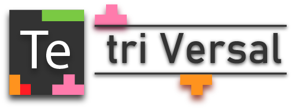

------------------------------------------------------------------------------------

<strong align="center">The multiplayer tetris game</strong>

------------------------------------------------------------------------------------

This is a game developed by myself and [Jaocbtread](https://github.com/jacobtread) for our multiplayer DGT project.

## Gameplay
Its just tetris, but every couple of seconds, a new player is chosen to controll the game, the modes 
have not been quite figured out yet, due to the game being very wip.

## Architecture
The server is written in nodejs and interfaces with the client via a websocket connection. We chose to go this
route because it made it easy to host a duplex connection between the client and server. The client side is implemented 
in rust using the piston game engine.

[Server Reop](https://github.com/jacobtread/tetriversal)
